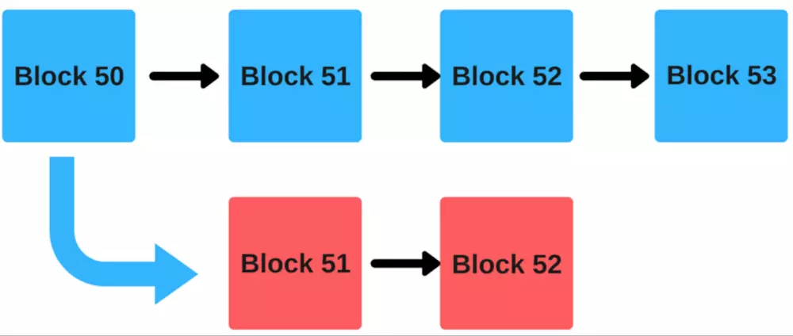

# 涉及区块链的专有名词

## ASIC

ASIC(Application Specific Integrated Circuits，专用集成电路)，是指应特定用户要求或特定电子系统的需要而设计、制造的集成电路。 ASIC作为集成电路（IC）技术与特定用户的整机或系统技术紧密结合的产物，与通用集成电路相比，在构成电子系统时具有以下几个方面的优越性：

1. 缩小体积、减轻重量、降低功耗；
2. 提高可靠性，用ASIC芯片进行系统集成后，外部连线减少，因而可靠性明显提高；
3. 易于获得高性能，ASIC是针对专门应用而特别设计的；系统设计、电路设计、工艺设计之间紧密结合，这种一体化的设计有利于获得前所未有的高性能系统；
4. 可增强保密性，电子产品中的ASIC芯片对用户来说相当于一个"黑匣子"，难于仿造；
5. 在大批量应用时，可显著降低系统成本。

**参考至：**[https://zhidao.baidu.com/question/142820538.html](https://zhidao.baidu.com/question/142820538.html)

---

## FPGA

FPGA（Field－ProgrammableGateArray），即现场可编程门阵列，它是在PAL、GAL、CPLD等可编程器件的基础上进一步发展的产物。它是作为专用集成电路（ASIC）领域中的一种半定制电路而出现的，既解决了定制电路的不足，又克服了原有可编程器件门电路数有限的缺点。

ASIC具有高性能、低功耗的优势，但它们包含的任何算法——除了那些在软件内部处理器内核执行的——其余都是“冻结的”。所以这个时候我们就需要现场可编程门阵列（FPGA）了。早期的FPGA器件的架构相对简单——只是一系列通过可编程互连的可编程模块。

FPGA最厉害的地方是，我们可以配置它的可编程架构来实现任意我们需要的数字功能组合。另外，我们可以以大规模并行的方式实施算法，这意味着我们可以非常迅速和有效地执行大数据的处理。

**参考至：**[http://www.elecfans.com/emb/fpga/20180105611384.html](http://www.elecfans.com/emb/fpga/20180105611384.html)

---

## 51%攻击

某个集团拥有网络51%的算力

51%攻击的两种收益，一是双花（一个比特币花两次）；二是做空比特币（通过攻击比特币，获取其他二级市场的收益），前者是直接收益，后者是间接收益

**参考至：**
[https://www.zhihu.com/question/21970544](https://www.zhihu.com/question/21970544)
[https://www.jianshu.com/p/82560d296759](https://www.jianshu.com/p/82560d296759)

---

## pos

POS机制的全称是proof of stake，中文名即权益证明，它主要是解决pow中资源浪费的问题。顾名思义，这是一种依据各人持币权益来达成共识的机制。它要求用户证明自身拥有货币的数量和时间，也就是证明你对货币的权益

POS机制当中引入了币龄的概念，用户拥有的币龄是其持有币数和时间的乘积。以点点币为例，用户每持一币一天拥有一币龄，持一币十天拥有十币龄，持十币十天拥有一百币龄。

而在POS机制中，用户每获得一定量的币龄，就可以开辟新区块，持有者的币龄越大，发现新区块的几率就越大。新区块开通后，币龄也会被使用消耗，但同时系统会给与一定量货币的奖励，也就是，屯币有利息。

pos的实现**算法公式**：

`hash(block_header) =< target * coinage`

币龄的计算：coinage = 币的个数*币的累计时间。这意味着，币龄越大，越容易得到答案。

虽然PoS机制避免了非常复杂的解密运算，但是每一笔交易依然需要网络中所有持有PoS的节点进行全体确认。

从算法的角度来看，pos主要有两种：基于区块链的权益证明和拜占庭容错（BFT）型权益证明。

在**基于区块链的权益证明**中，共识算法在每个时段内伪随机地选择一个验证者（例如，每10秒钟为一个时间段），赋予该验证者出块的权力，新创造的区块必须跟在之前的某个区块（通常是位于最长链的末端的区块）后面。因此，随着时间的推移，大多数区块会填加到同一条区块链上，使之不断增长。

在**拜占庭容错型权益证明**中，虽然提议区块的权力会随机分配给验证者，但是决定哪一个区块是“合法的”要通过一个多轮过程来完成。每个验证者在每一轮都会给某个特定的区块投出一票，在这个多轮过程的最后，所有（诚实并联网的）验证者会就是否将这个区块添加到链上做出最终决定。要注意的是这些区块可能仍然链接在一起，其关键区别在于对一个区块的共识可以仅限于这个区块本身，与它后面的那条链的长度和大小无关。

**以上参考至：**[https://baijiahao.baidu.com/s?id=1605870811769017575&wfr=spider&for=pc](https://baijiahao.baidu.com/s?id=1605870811769017575&wfr=spider&for=pc)
[https://ethfans.org/posts/Proof-of-Stake-FAQ-new-2018-3-15](https://ethfans.org/posts/Proof-of-Stake-FAQ-new-2018-3-15)

---

## DPOS

Delegated Proof of Stake，委任权益证明

在常规 PoW 和 PoS 中，一大影响效率之处在于任何一个新加入的 Block，都需要被整个网络所有节点做确认。

DPoS 优化方案在于：通过不同的策略，不定时的选中一小群节点，这一小群节点做新区块的创建，验证，签名和相互监督，这样就大幅度的减少了区块创建和确认所需要消耗的时间和算力成本。

比特股的DPoS机制，中文名叫做股份授权证明机制（又称受托人机制），它的原理是让每一个持有比特股的人进行投票，由此产生101位代表 , 我们可以将其理解为101个超级节点或者矿池，而这101个超级节点彼此的权利是完全相等的。从某种角度来看，DPOS有点像是议会制度或人民代表大会制度。如果代表不能履行他们的职责（当轮到他们时，没能生成区块），他们会被除名，网络会选出新的超级节点来取代他们。DPOS的出现最主要还是因为矿机的产生，大量的算力在不了解也不关心比特币的人身上，类似演唱会的黄牛，大量囤票而丝毫不关心演唱会的内容。

**参考至：** [https://blog.csdn.net/lsttoy/article/details/61624287](https://blog.csdn.net/lsttoy/article/details/61624287)

---

## Casper

Casper是下一代以太坊共识机制 ，Casper 是 PoS协议的一种实现形式，第一次在 2016年的 《以太坊紫皮书》中被提出。在Casper的规则中，任何拥有以太币的账户都可以在合约中成为验证者，但前提是需要在Casper智能合约中抵押一定数量的以太币（抵押的越多，被选中作为验证者的概率越大），之后Casper合约通过一种随机方式，选出一个验证者集合，被选中的验证者集合按照一定的顺序依次验证区块，如果所有验证都通过，则将其添加到区块链中，同时所有验证者将根据抵押以太币的比例获得奖励，如果不遵守合约制定的规则，合约就会没收抵押的以太币作为惩罚。

casper运行机制 [https://www.jianshu.com/p/953558bb5e64](https://www.jianshu.com/p/953558bb5e64)

１. 验证者押下一定比例的他们拥有的以太币作为保证金。
２. 然后，他们将开始验证区块。也就是说，当他们发现一个可以他们认为可以被加到链上的区块的时候，他们将以通过押下赌注来验证它
３. 如果该区块被加到链上，然后验证者们将得到一个跟他们的赌注成比例的奖励。  
４. 但是，如果一个验证者采用一种恶意的方式行动、试图做“无利害关系”的事，他们将立即遭到惩罚，他们所有的权益都会被砍掉。

**参考至：** [https://my.oschina.net/ruoli/blog/1807388](https://my.oschina.net/ruoli/blog/1807388)

---

## PoW + PoS 混合机制

为了结合两种挖矿方式的优点，开始有了基于 PoW+PoS 混合共识机制的币。例如 Hcash，以及以太坊 ETH 也正在向 PoW+PoS 混合挖升级矿转变。

那么，PoW + PoS 混合机制的优势是什么呢？

它能够将受众群体最大化。

假设一个币它的机制是PoW + PoS 的混合机制。那么持有该币的用户与矿工均可以参与到投票中，共同参与该币社区的重大决定，持币者与矿工都可以影响预先编制好的更新，如隔离见证（SegWit）、增大区块等等。如果这些更新被广泛认可，无需开发者干预，链就会自动分叉以配合更新。而这才是真正的去中心化。

以混合机制来实现广义上的 DAO（去中心化自治组织）的高效运行。通过 PoW+PoS 公平的按持币数量与工作量分配投票权重，实现社区自治。

**参考至：** [https://my.oschina.net/ruoli/blog/1807388](https://my.oschina.net/ruoli/blog/1807388)

---

## PoA

所谓 PoA （权威证明），就是使用一组所谓的“权限” 来允许人们在区块链上创建新的节点并确保区块链的安全。以太坊测试网（Kovan）便是采用PoA算法。

在PoA中，验证者（validator）是整个共识机制的关键。验证者不需要昂贵的显卡，也不需要足够的资产，但他必须具有已知的，并且已获得验证的身份。验证者通过放置这个身份来获得担保网络的权利，从而换取区块奖励。若是验证者在整个过程中有恶意行为，或与其他验证者勾结。那通过链上管理可以移除和替换恶意行为者。现有的法律反欺诈保障会被用于整个网络的参与者免受验证者的恶意行为。

什么是POA网络？ POA网络便是建立在PoA共识之上的底层区块链。在POA网络中，每个验证者（validator）都必须在美国境内拥有公证许可。人们需要通过POA网络身份DApps进行身份验证，包括住址证明和无犯罪记录证明等。然后进行所谓的启动仪式（initiation ceremony）来获得密钥。通过的验证者便可以担当起保护网络的安全的重任，并获得回报。 POA网络作为一个底层链，其上的每一个新的专用链都可以使用相同的验证器，或者拥有自己的一套验证器以及其他任何类型的可验证许可证。

通俗的理解就是，以前我们交易需要一群互不认识的人来拼算力，艰难的计算一道复杂的数学题，从而争出个输赢。而现在，我们只需要有一个信得过的人（至少得到了他们团队的认可）做担保，便可快速通过交易。而这个人也会因为为这笔交易做担保，而获得报酬。要是这个担保人使坏怎么办？没关系，其他的可信担保人看着呢，他要是敢使坏，我踢你出局。而要是担保人故意为难你呢？没关系，现有的法律可以保证你的合法权益（注意，数字资产丢失不在我国法律保护范围）。

***POA 权威证明的优点***

* 官方宣称5s就能打包一个区块，交易时间快。
* 不需要挖矿，节能环保。
* 整个网络，验证者互相监督，随时可以投票加入新的验证者或者剔出不合格验证者。
* 所有的验证者都跟网络签署了协议，不能在POA上建立新的分叉。
* 高度可扩展性和高度兼容性。

**参考至：** [https://my.oschina.net/ruoli/blog/1807388](https://my.oschina.net/ruoli/blog/1807388)

---

## 两将军问题

拜占庭问题之前，学术界就已经存在两将军问题的讨论（《Some constraints and tradeofis in the design of network communications》，1975 年）：两个将军要通过信使来达成进攻还是撤退的约定，但信使可能迷路或被敌军阻拦（消息丢失或伪造），如何达成一致？根据 FLP 不可能原理，这个问题无通用解。

## 拜占庭问题

拜占庭问题（Byzantine Problem）又叫拜占庭将军（Byzantine Generals Problem）问题，讨论的是允许存在少数节点作恶（消息可能被伪造）场景下的如何达成共识问题。

正式定义一下问题，拜占庭将军问题实际上指的是在一个有 n 个节点的集群内，有 t 个节点可能发生任意错误的情况下，如果 n <= 3t，一个正确的 consensus 不可能达成。

任意错误指的就是坏节点可以发送任意消息，而 consensus 即每个节点会提出一个值，并且最终决定同一个值，要求如下：

1. 所有正确的节点最终会决定一个值（termination）
2. 所有正确的节点决定的值必须相同（agreement）
3. 所有正确的节点决定的值必须是被正确的节点提出来的（validity）

**参考至：** [https://yeasy.gitbooks.io/blockchain_guide/content/distribute_system/bft.html](https://yeasy.gitbooks.io/blockchain_guide/content/distribute_system/bft.html)
[https://www.zhihu.com/question/23167269](https://www.zhihu.com/question/23167269)

**[中本聪与拜占庭将军问题](https://www.jianshu.com/p/5fea30b25f0a)**

---

## 分片技术

分片技术，是为了进一步提升系统处理交易的速度。分片技术指的是，先将节点分组，再将完整的交易数据分片，随机放到不同组内验证，最终结果打包成“块”，组成“链”

分片技术就像写书一样。首先，系统将“写作主题”，也就是一定时间内的交易信息，梳理出“章节目录”；然后，随机将不同章节的写作任务，分配给不同的小组。大家分头写完后，再组合成“书”

## 无成本利益关系（Nothing at Stake）

如下图所示是一个区块链分叉的场景：

假设我们处在上面的这种情况下，有一条蓝色的主链和一条红色的从主链中分出来的链条，如何禁止一个恶意的矿工在红色区块上挖矿然后推动一次硬分叉（Hard Fork）呢？

在一个工作量证明系统上，这一风险是可以被减轻的。

假设恶意矿工想在红色链上挖矿。即便她投入了她所有的哈希算力，也不会有任何矿工加入她在新链上挖矿。每个其他人都将继续在蓝色链上挖矿，因为在最长的链上挖矿收益更可观，而且没有风险。

记住，工作量证明在资源方面是非常昂贵的。对一个矿工来说，花费许多资源在一个将会被网络拒绝的区块上是没有任何意义的。因此，链分裂在一个工作量证明系统中是被避免了的，因为攻击者将不得不付出大量金钱。

 但是，当你把这种情形放到到权益证明下的时候，事情看起来就有些不一样了。如果你是一个验证者，你可以简单地把钱投到红蓝两条链上，完全无需担心间接的不良后果。不管发生什么事，你都总是可以赢，不会失去任何东西，不管你的行为有多恶意。

这就是所谓的“无成本利益关系（Nothing at Stake）”问题，也是以太坊必须解决的问题。他们需要一种协议，可以实行权益证明，同时减少“无成本利益关系”问题。

**参考至：** [https://www.jianshu.com/p/953558bb5e64](https://www.jianshu.com/p/953558bb5e64)

---

## CAP理论

一个分布式系统最多只能同时满足 一致性（Consistency），可用性（Availability）和分区容错性（Partition tolerance）这三项中的两项。

### 一致性（Consistency）

即一致性，访问所有的节点得到的数据应该是一样的。注意，这里的一致性指的是强一致性，也就是数据更新完，访问任何节点看到的数据完全一致，要和弱一致性，最终一致性区分开来。

弱一致性（Weak）：写入一个数据a成功后，在数据副本上可能读出来，也可能读不出来。不能保证多长时间之后每个副本的数据一定是一致的。

最终一致性（Eventually）：写入一个数据a成功后，在其他副本有可能读不到a的最新值，但在某个时间窗口之后保证最终能读到。可以看做弱一致性的一个特例。这里面的重点是这个时间窗口。

强一致性（Strong）：数据a一旦写入成功，在任意副本任意时刻都能读到a的最新值。

**弱一致、最终一致和强一致参考至：**[https://cloud.tencent.com/developer/article/1015442](https://cloud.tencent.com/developer/article/1015442)

### 可用性（Availability）

即可用性，所有的节点都保持高可用性。注意，这里的高可用还包括不能出现延迟，比如如果节点B由于等待数据同步而阻塞请求，那么节点B就不满足高可用性。

也就是说，任何没有发生故障的服务必须在有限的时间内返回合理的结果集。

### 分区容错性（Partition tolerance）

即分区容忍性，这里的分区是指网络意义上的分区。由于网络是不可靠的，所有节点之间很可能出现无法通讯的情况，在节点不能通信时，要保证系统可以继续正常服务。

**参考至：** [https://www.jianshu.com/p/482ba491a760](https://www.jianshu.com/p/482ba491a760)
[https://cloud.tencent.com/developer/article/1015442](https://cloud.tencent.com/developer/article/1015442)

---

## 分布式系统时钟问题

**参考：**[https://wenku.baidu.com/view/ad317307ec3a87c24028c4bb.html](https://wenku.baidu.com/view/ad317307ec3a87c24028c4bb.html)

---

## 隔离见证

隔离见证就是指将锁定脚本与解锁脚本中的部分内容从交易中分离出来，放入一个独立的数据结构中。隔离见证简称Segwit

**参考至：** [https://bbs.huaweicloud.com/blogs/710256bf476611e89fc57ca23e93a89f](https://bbs.huaweicloud.com/blogs/710256bf476611e89fc57ca23e93a89f)
