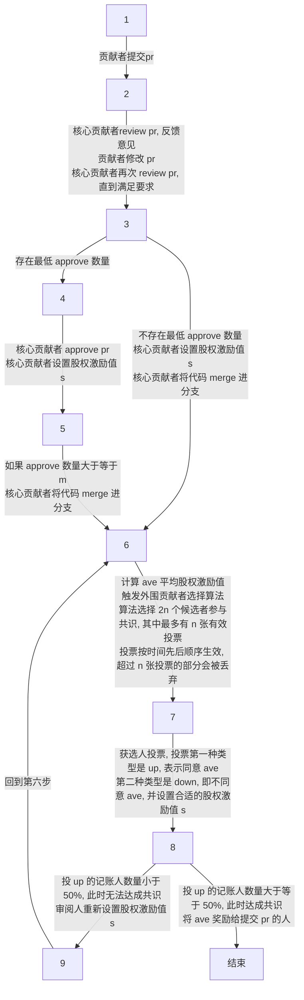

# 共识机制

**目标**：pull request 审阅人为奖励提交 pr 的人所做的贡献，会主观设置股权激励值，然后挑选数量一定的外围贡献者对该股权激励值设置是否合理进行共识

## 外围贡献者选择算法

**目标**：选择 $2n$ 个候选人参与投票，其中只有 $n$ 个人会成为记账人（投票按时间先后顺序生效，多余的投票将会被丢弃）

*考虑到开源社区的场景，候选人不会经常在线，所以选择 2n 个候选人参与投票，加快共识过程。候选人中实际参与共识的人数为 n。*

**约束**：

- 贡献 pr 中 commit 的贡献者无法被选择

**符号**：

- $R(x)$：贡献者排名
- $A(x)$：用户活跃度（如代码贡献行数）
- $M(x)$：用户成功参与共识的次数
- $n$：记账人数量
- $m$：系数
- $c$：外围贡献者人数
- $username_i$：用户 $i$ 的用户名
- $h_{standard}$：标准哈希值，通过时间戳 + 所有外围贡献者用户名计算获得
- $h_{usernmae}(i)$：通过用户名、标准哈希值计算获得的新的用户排名

**选择算法**：

1. 确定记账人数量：$n=[log_2c*m]$，$2*n<=c$
2. 计算贡献者排名：$R(x)=A(x)/(M(x)+1)$
3. 按照 $R(x)$ 排名，从大到小选择 $2n$ 个候选人。如果存在排名重复导致只能选择 $k$ 个候选人（$k<2n$），则使用下面的方法选择剩下的 $2n-k$ 个候选人
4. 标准哈希值计算：$h_{standard}=hash(time+username_1+username_2+...+username_n)$

5. 按用户名和标准哈希值计算新的排名：$h_{username}(i)=|hash(username_i-h_{standard})|$

6. 按新排名从大到小选择剩下的 $2n-k$ 个候选人

*成功参与共识的贡献者其 $A(x)$ 将被清零*

## 核心贡献者选择

延续现有开源社区规则：可设置最低 approve 数 $c$，approve 数量大于等于 $c$ 之后才可以合并 pr。

## 共识过程

**符号**：

- $s$：股权激励值，四个档次，A：50、B：200、C：500、D：1000
- $ave$：平均股权激励值
- $m$：项目要求最低 approve 数量
- $n$：记账人数量
- $up$：同意设置的平均股权激励值
- $down$：不同意设置的平均股权激励值
- $timeout$：每回合共识的超时时间
- $l$：最大共识轮次，超过 $l$ 还没有达成共识，则触发算法选择新的一批候选者

**过程**

1. 贡献者提交 pr

2. 核心贡献者 review pr，反馈意见，修改 pr，再次 review，直到满足要求，approve pr。

3. 核心贡献者设置股权激励值 $s$ 

4. approve 数量大于等于 $m$，代码成功 merge 进分支（代码合并和股权激励值共识分开）。

5. 计算 $ave=(s1+...+sm)/m$，触发外围贡献者选择算法

6. 算法选择 $2n$ 个候选者参与共识，其中最多有 $n$ 张有效投票，投票按时间先后顺序生效，超过 $n$ 张投票的部分会被丢弃。

   投票有两种类型：第一种类型是 $up$，第二种类型是 $down$ 并设置合适的股权激励值 $s$

   结果有两种类型：

   1. 投 $up$ 的记账人数量大于等于 50%，此时达成共识，将 $ave$ 奖励给提交 pr 的人。

    	2. 投 $up$ 的记账人数量小于 50%，此时无法达成共识，审阅人重新设置股权激励值 $s$，然后回到第五步

**其它**：

1. 达到超时时间 $timeout$ 还没有 $n$ 张有效投票，此时触发超时事件，以有效投票为基准计算共识结果

2. 没有人投票或者存在作恶的贡献者，故意让 pr 股权激励值无法达成共识。设置最大共识轮次 $l$，超过 $l$ 还没有达成共识，则触发算法选择新的一批候选者、记账人
3. 允许举报恶意贡献者，若同一贡献者被多次举报，将永久剥夺其参与共识的权利

## 可能存在的问题

- 未活跃的外围贡献者远远大于活跃的外围贡献者，未活跃的外围贡献者经常不在线，无法参与共识
- 同类型的 pr （解决同一个问题）如何规避？涉及到利益归属问题