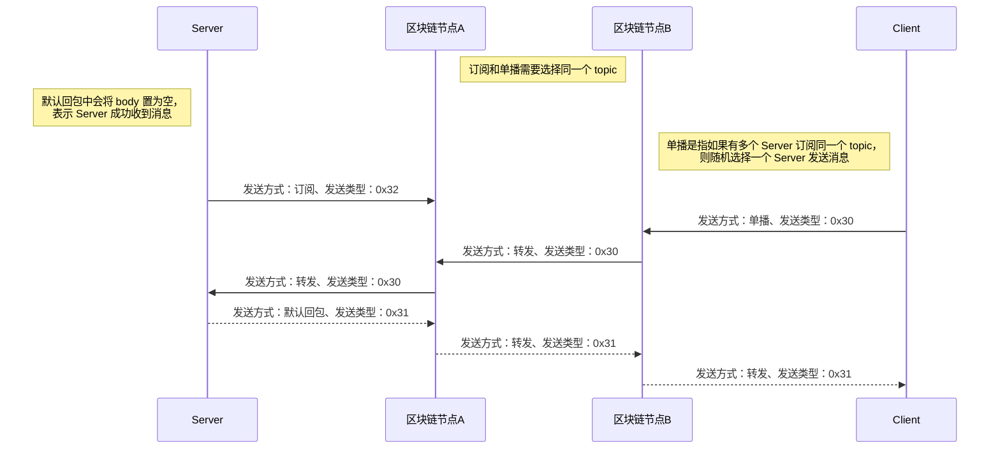
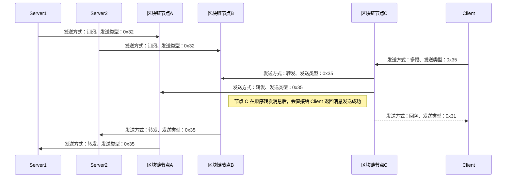
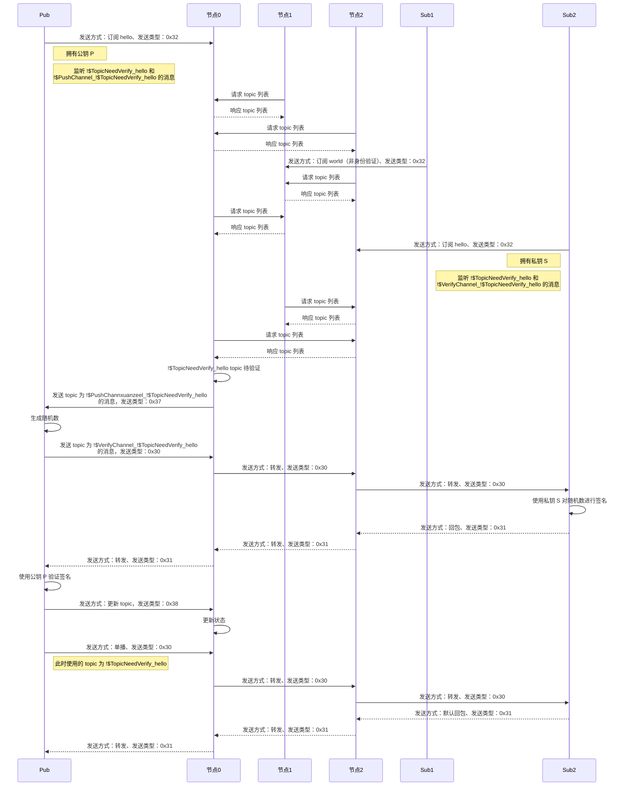

[toc]

# 时序图

## 单播时序图

```mermaid
sequenceDiagram

  participant Server

  participant 区块链节点A
 
  participant 区块链节点B
  
  participant Client
  
  Note left of 区块链节点B: 订阅和单播需要选择同一个 topic
  
  Note left of Server: 默认回包中会将 body 置为空，<br>表示 Server 成功收到消息
  
  Note left of Client: 单播是指如果有多个 Server 订阅同一个 topic，<br>则随机选择一个 Server 发送消息

  Server->>区块链节点A: 发送方式：订阅、发送类型：0x32

  Client->>区块链节点B: 发送方式：单播、发送类型：0x30

  区块链节点B->>区块链节点A: 发送方式：转发、发送类型：0x30

  区块链节点A->>Server: 发送方式：转发、发送类型：0x30

  Server-->>区块链节点A: 发送方式：默认回包、发送类型：0x31

  区块链节点A-->>区块链节点B: 发送方式：转发、发送类型：0x31

  区块链节点B-->>Client: 发送方式：转发、发送类型：0x31
```

## 多播时序图

```mermaid
sequenceDiagram

  participant Server1
  
  participant Server2

  participant 区块链节点A
 
  participant 区块链节点B
  
  participant 区块链节点C
  
  participant Client

  Server1->>区块链节点A: 发送方式：订阅、发送类型：0x32
  
  Server2->>区块链节点B: 发送方式：订阅、发送类型：0x32

  Client->>区块链节点C: 发送方式：多播、发送类型：0x35
  
  区块链节点C->>区块链节点B: 发送方式：转发、发送类型：0x35

  区块链节点C->>区块链节点A: 发送方式：转发、发送类型：0x35
  
  Note left of 区块链节点C: 节点 C 在顺序转发消息后，会直接给 Client 返回消息发送成功
  
  区块链节点C-->>Client: 发送方式：回包、发送类型：0x31

  区块链节点B->>Server2: 发送方式：转发、发送类型：0x35

  区块链节点A->>Server1: 发送方式：转发、发送类型：0x35

```

## 带身份验证的单播时序图

```mermaid
sequenceDiagram
  
  participant Pub

  participant 节点0
 
  participant 节点1
  
  participant 节点2

  participant Sub1
  
  participant Sub2
  
  Pub->>节点0: 发送方式：订阅 hello、发送类型：0x32
  
  Note right of Pub: 拥有公钥 P
  
  Note right of Pub: 监听 !$TopicNeedVerify_hello 和<br>!$PushChannel_!$TopicNeedVerify_hello 的消息
  
  节点1->>节点0: 请求 topic 列表
  
  节点0-->>节点1: 响应 topic 列表
  
  节点2->>节点0: 请求 topic 列表
  
  节点0-->>节点2: 响应 topic 列表

  Sub1->>节点1: 发送方式：订阅 world（非身份验证）、发送类型：0x32
  
  节点2 ->> 节点1: 请求 topic 列表
  
  节点1-->>节点2: 响应 topic 列表
  
  节点0->>节点1: 请求 topic 列表
  
  节点1-->>节点0: 响应 topic 列表
  
  Sub2->>节点2: 发送方式：订阅 hello、发送类型：0x32
  
  Note left of Sub2: 拥有私钥 S
  
  Note left of Sub2: 监听 !$TopicNeedVerify_hello 和<br>!$VerifyChannel_!$TopicNeedVerify_hello 的消息
  
  节点1 ->> 节点2: 请求 topic 列表
  
  节点2-->>节点1: 响应 topic 列表
  
  节点0->>节点2: 请求 topic 列表
  
  节点2-->>节点0: 响应 topic 列表

  节点0->>节点0: !$TopicNeedVerify_hello topic 待验证

  节点0->>Pub: 发送 topic 为 !$PushChannxuanzeel_!$TopicNeedVerify_hello<br>的消息，发送类型：0x37
  
  Pub->>Pub: 生成随机数
  
  Pub->>节点0: 发送 topic 为 !$VerifyChannel_!$TopicNeedVerify_hello<br>的消息，发送类型：0x30
  
  节点0->>节点2: 发送方式：转发、发送类型：0x30
  
  节点2->>Sub2: 发送方式：转发、发送类型：0x30
  
  Sub2->>Sub2: 使用私钥 S 对随机数进行签名
  
  Sub2-->>节点2: 发送方式：回包、发送类型：0x31
  
  节点2-->>节点0: 发送方式：转发、发送类型：0x31
  
  节点0-->>Pub: 发送方式：转发、发送类型：0x31
   
  Pub->>Pub: 使用公钥 P 验证签名
  
  Pub->>节点0: 发送方式：更新 topic，发送类型：0x38
  
  节点0->>节点0: 更新状态
  
  Pub->>节点0: 发送方式：单播、发送类型：0x30
  
  Note right of Pub: 此时使用的 topic 为 !$TopicNeedVerify_hello

  节点0->>节点2: 发送方式：转发、发送类型：0x30
  
  节点2->>Sub2: 发送方式：转发、发送类型：0x30

  Sub2-->>节点2: 发送方式：默认回包、发送类型：0x31

  节点2-->>节点0: 发送方式：转发、发送类型：0x31

  节点0-->>Pub: 发送方式：转发、发送类型：0x31
```

