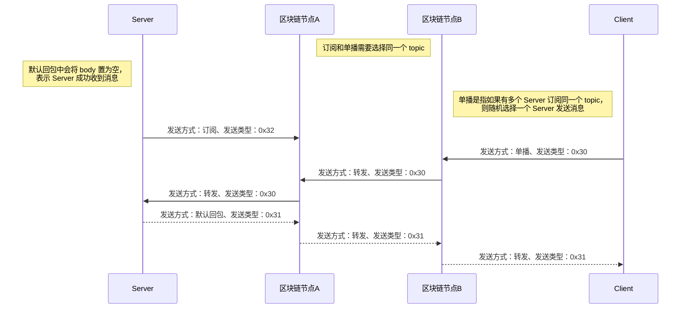
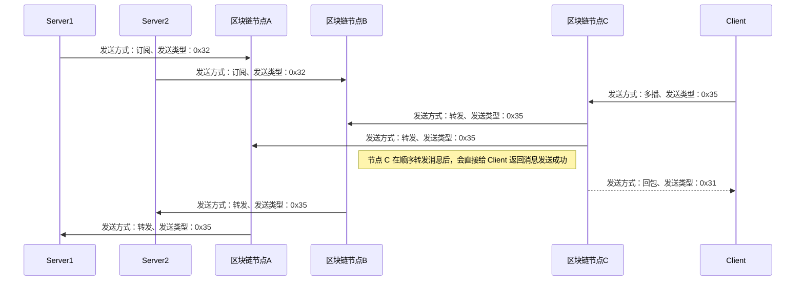

[toc]

# 时序图

## 单播时序图

```mermaid
sequenceDiagram

  participant Server

  participant 区块链节点A
 
  participant 区块链节点B
  
  participant Client
  
  Note left of 区块链节点B: 订阅和单播需要选择同一个 topic
  
  Note left of Server: 默认回包中会将 body 置为空，<br>表示 Server 成功收到消息
  
  Note left of Client: 单播是指如果有多个 Server 订阅同一个 topic，<br>则随机选择一个 Server 发送消息

  Server->>区块链节点A: 发送方式：订阅、发送类型：0x32

  Client->>区块链节点B: 发送方式：单播、发送类型：0x30

  区块链节点B->>区块链节点A: 发送方式：转发、发送类型：0x30

  区块链节点A->>Server: 发送方式：转发、发送类型：0x30

  Server-->>区块链节点A: 发送方式：默认回包、发送类型：0x31

  区块链节点A-->>区块链节点B: 发送方式：转发、发送类型：0x31

  区块链节点B-->>Client: 发送方式：转发、发送类型：0x31
```

## 多播时序图

```mermaid
sequenceDiagram

  participant Server1
  
  participant Server2

  participant 区块链节点A
 
  participant 区块链节点B
  
  participant 区块链节点C
  
  participant Client

  Server1->>区块链节点A: 发送方式：订阅、发送类型：0x32
  
  Server2->>区块链节点B: 发送方式：订阅、发送类型：0x32

  Client->>区块链节点C: 发送方式：多播、发送类型：0x35
  
  区块链节点C->>区块链节点B: 发送方式：转发、发送类型：0x35

  区块链节点C->>区块链节点A: 发送方式：转发、发送类型：0x35
  
  Note left of 区块链节点C: 节点 C 在顺序转发消息后，会直接给 Client 返回消息发送成功
  
  区块链节点C-->>Client: 发送方式：回包、发送类型：0x31

  区块链节点B->>Server2: 发送方式：转发、发送类型：0x35

  区块链节点A->>Server1: 发送方式：转发、发送类型：0x35

```

