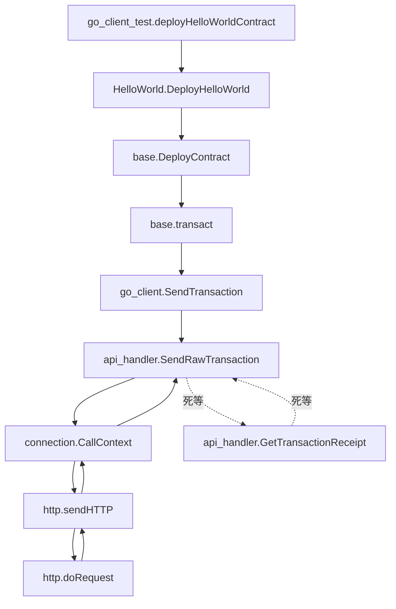
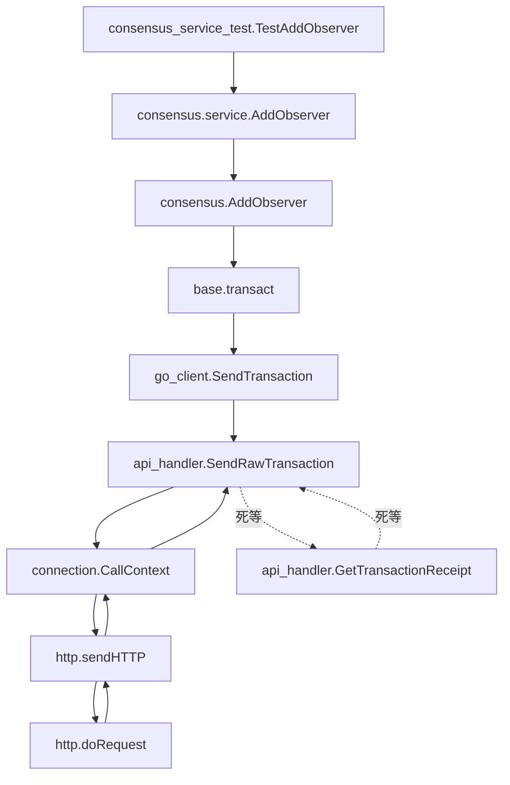
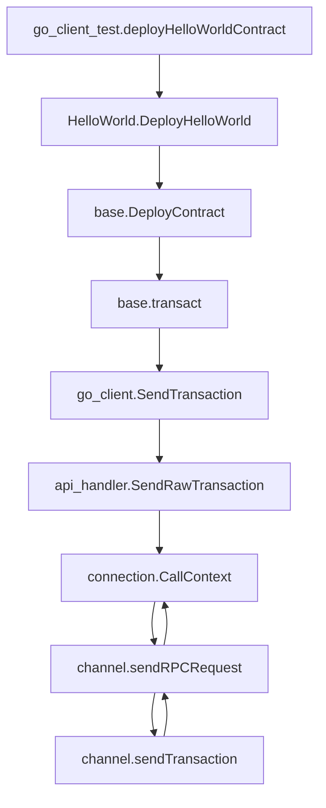
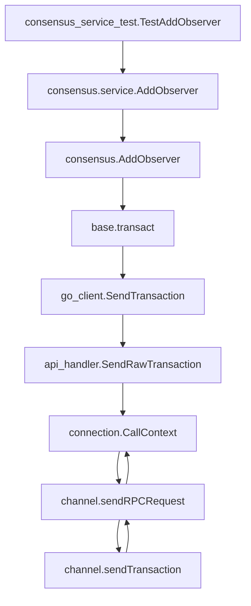
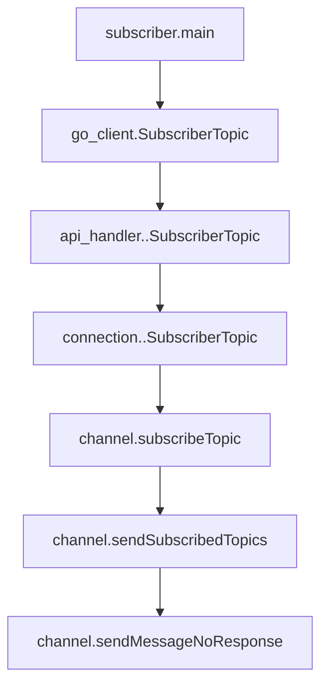
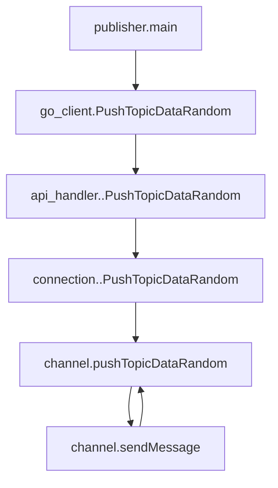

[toc]

# 超时时间方案

## http 请求

### 查询类型请求

**测试用例**：go_client_test 中 TestBlockHashByNumber 

### 部署合约类型请求

**测试用例**：go_client_test 中 deployHelloWorldContract

**api_handler.SendRawTransaction 会死等 tx.receipt，需要设置超时时间**

### 修改、插入、删除类型请求

**测试用例**：consensus_service_test 中 TestAddObserver

同上，**api_handler.SendRawTransaction 会死等 tx.receipt，需要设置超时时间**

## channel 请求

### 查询类型请求

**测试用例**：go_client_test 中 TestBlockHashByNumber 

*channel.doRequest 中阻塞，需要设置超时时间*

### 部署合约类型请求

**测试用例**：go_client_test 中 deployHelloWorldContract

**channel.sendTransaction 同步阻塞两次，一次等交易，一次等交易收据**

### 修改、插入、删除类型请求

**测试用例**：consensus_service_test 中 TestAddObserver

同上，**channel.sendTransaction 同步阻塞两次，一次等交易，一次等交易收据**

### AMOP 请求

#### subscriber

**测试用例**：amop/sub/subscriber

*无阻塞*

#### unique broadcast publisher

**测试用例**：amop/unicast_pub/publisher

*channel.sendMessage 中阻塞，接受单播的回包*

#### multi broadcast publisher 

**测试用例**：amop/multicast/publisher

*同上，channel.sendMessage 中阻塞，接受多播的回包*

## 超时时间方案

根据 http 请求和channel 请求类型可将超时设置分为四种：*http 交易类型请求*、*channel 查询类型请求*、*channel 交易类型请求*、*channel AMOP 单播和多播请求*

- *http 交易类型请求*：api_handler.SendRawTransaction 会同步阻塞等待 tx.receipt，在 connection 添加全局超时配置项 *HttpTransactionTimeout*，默认为 *5s*。同时对外暴露接口 *setHttpTransactionTimeout()* 以提供修改该配置项的入口
- *channel 查询类型请求*：channel.doRequest 中阻塞，在 connection 添加全局超时配置项 *channelSelectTimeout*，默认为 *5s*。同时对外暴露接口 *setChannelSelectTimeout()* 以提供修改该配置项的入口

- *channel 交易类型请求*：channel.sendTransaction 中阻塞两次，在 connection 添加全局超时配置项 *channelTransactionTimeout*，默认为 *5s*。同时对外暴露接口 *setChannelTransactionTimeout()* 以提供修改该配置项的入口

- *channel AMOP 单播和多播请求*：channel.sendMessage 中阻塞，在 connection 添加全局超时配置项 *amopPushTimeout*，默认为 *5s*。同时对外暴露接口 *setAmopPushTimeout()* 以提供修改该配置项的入口