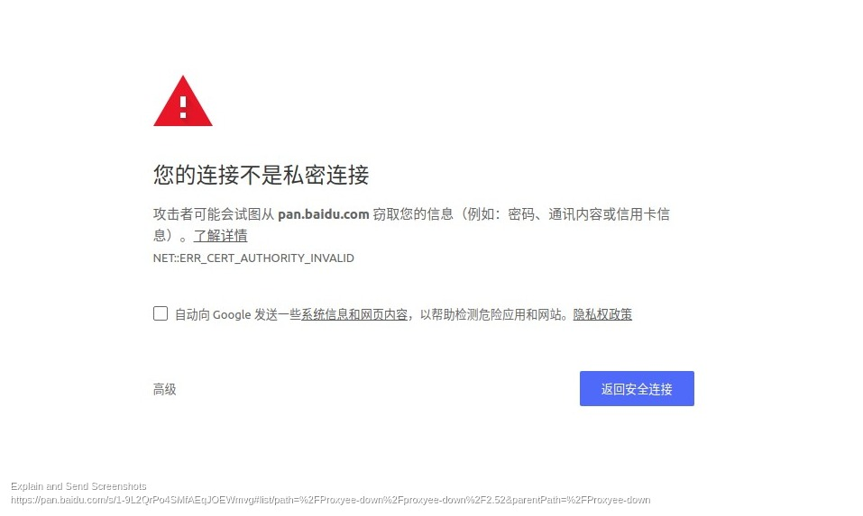

# 工具

## proxyee-down

网址：[https://github.com/proxyee-down-org/proxyee-down](https://github.com/proxyee-down-org/proxyee-down)

终端执行命令：`java -jar proxyee-down-main.jar`

启动之后开启的端口：`http://127.0.0.1:7478`

使用教程：[https://github.com/proxyee-down-org/proxyee-down/wiki/%E4%BD%BF%E7%94%A8%E6%95%99%E7%A8%8B](https://github.com/proxyee-down-org/proxyee-down/wiki/%E4%BD%BF%E7%94%A8%E6%95%99%E7%A8%8B)

按照教程一步一步来即可（可能需要使用Switchy Omega插件，也按教程即可）

利用Switchy Omega插件使用百度云下载可能需要导入证书，导入步骤可以参考`xx-net`的基本安装步骤

