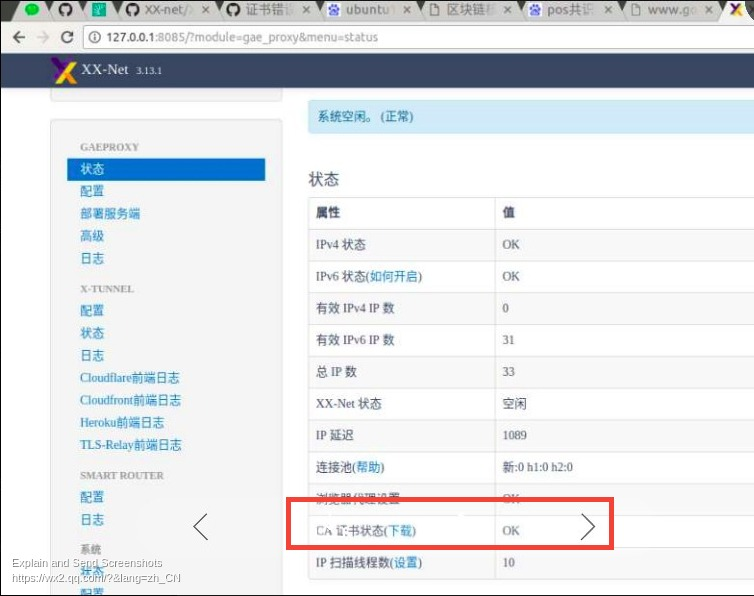
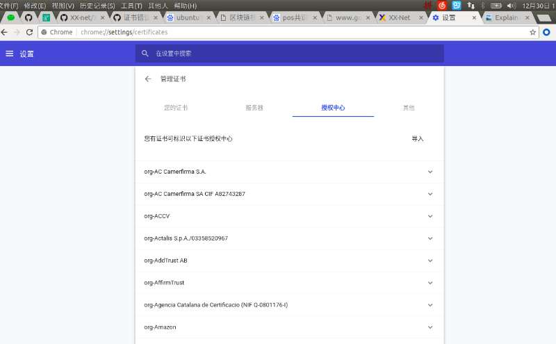
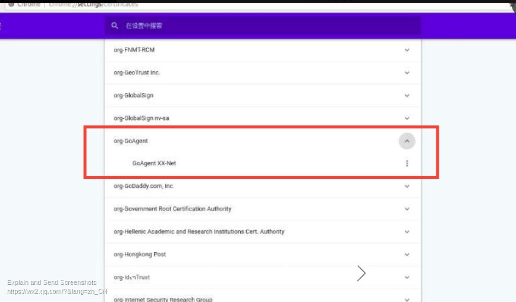
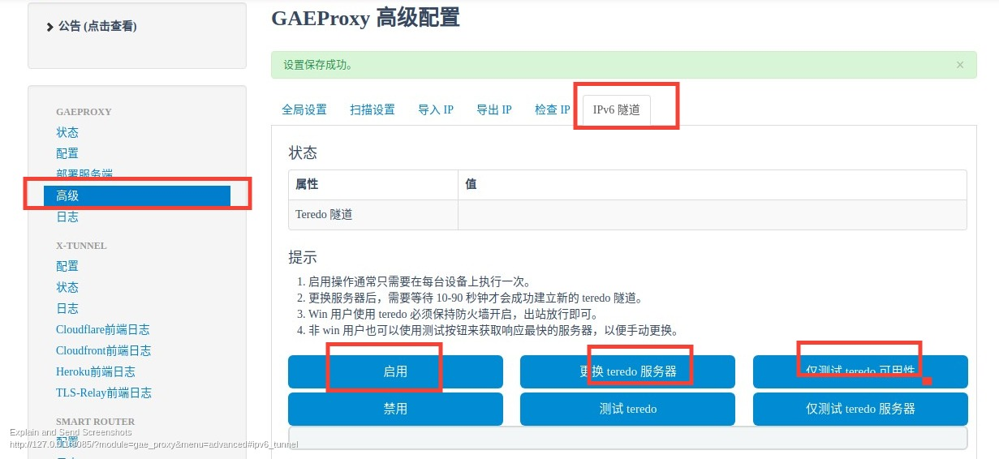

# 基本安装步骤

1. 下载xx-net最新版：[https://github.com/XX-net/XX-Net](https://github.com/XX-net/XX-Net)
2. 解压xx-net
3. chrome安装SwitchyOmega
4. 导入SwitchyOmega文件夹下的SwitchyOmega.bak，从import/Export 里面的restore from file导入SwitchyOmega.bak
5. 可能还需要安装一些依赖。。。
6. 在xx-net的目录中打开终端输入`./start`
7. 打开`127.0.0.1:8085`，在==状态==中下载CA证书，并将证书导入chrome浏览器

如果之前装过一次的话，需要删除上一次导入的同一个证书

8. 开启IPv6，点击`高级`，然后点击`IPv6隧道`，然后点击`启用`、`更换teredo服务器`和`仅测试teredo可用性`

9. 切换浏览器插件`SwitchyOmega`的代理模式为`Smart-Router`，打开新的浏览器测试，不出意外的话应该会成功........