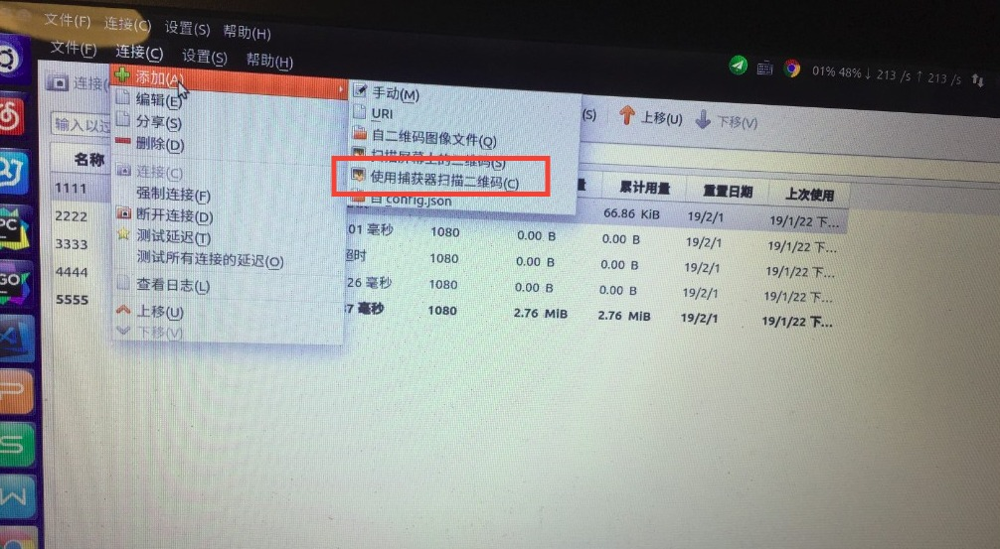

# 科学上网

## 1. 安装shadowsocks-qt5

```shell
sudo add-apt-repository ppa:hzwhuang/ss-qt5
sudo apt-get update
sudo apt-get install shadowsocks-qt5
```

第一行代码是添加软件的ppa源，当然，这是作者提供的

然后执行update更新并安装shadowsocks-qt5。

如果安装成功之后，按win键搜索应该能够找到软件，如下图所示:


## 2. 配置shadowsocks-qt5

如图



此外也可以手动配置

## 3. 配置系统代理(这一步可以舍弃)

==如果加上这一步会出现网易云音乐等APP无法使用的情况==

单独配置shadowsocks-qt5并不能使用网络，所以还要配置系统的代理。

打开 `设置-网络-网络代理`

代理方式选择 `手动` ，第一个 `http代理` 清空配置，端口设置为 `0` ，然后第四个 `socks代理` 设置为 `127.0.0.1` ，端口填写 `1080` ，ip和端口在`shadowsocks-qt5` 中有设置，使用默认的就好

##　4. 配置浏览器（Chrome）

应该来说现在能上网了，但是对于浏览器来说，我们可以添加插件用来自动判断当前网址是否需要科学上网。

我在这里使用的是chrome，所以使用chrome的方法来写教程。

### 一. 安装插件

我们需要给chrome安装SwitchyOmega插件，但是没有代理之前是不能从谷歌商店安装这个插件的，但是我们可以从Github上直接下载最新版 [https://github.com/FelisCatus/SwitchyOmega/releases/](https://github.com/FelisCatus/SwitchyOmega/releases/)（这个是chrome的）然后浏览器地址打开chrome://extensions/，将下载的插件托进去安装。

### 二. 设置代理地址

安装好插件会自动跳到设置选项，有提示你可以跳过。左边新建情景模式-选择代理服务器-比如命名为SS（叫什么无所谓）其他默认之后创建，之后在代理协议选择SOCKS5，地址为127.0.0.1,端口默认1080 。然后保存即应用选项。


### 三. 设置自动切换

接着点击自动切换 ( Auto switch）上面的不用管，在按照规则列表匹配请求后面选择刚才新建的SS，默认情景模式选择直接连接。点击应用选项保存。再往下规则列表设置选择AutoProxy 然后将这个 [地址](https://raw.githubusercontent.com/gfwlist/gfwlist/master/gfwlist.txt) 填进去，点击下面的立即更新情景模式，会有提示更新成功！


点击浏览器右上角的SwitchyOmega图标，下面选择自动切换，然后打开google.com试试

## 5. 添加shadowsocks-qt5自动启动

使用一段时间后你应该会发现每次开机都要手动运行shadowsocks-qt5，所以我们还要添加shadwsocks-qt5的自动启动。

`Ctrl+Alt+T` 打开终端，输入下面的指令：

`gnome-session-properties`

然后弹出这样的窗口：


点击右边的add，然后选择/usr/bin/ss-qt5，名称随便输，保存即可。

## 6. 总结

**参考至：**

[https://mystery0.vip/2017/01/12/Ubuntu%E4%BD%BF%E7%94%A8Shadowsocks-qt5%E7%A7%91%E5%AD%A6%E4%B8%8A%E7%BD%91/](https://mystery0.vip/2017/01/12/Ubuntu%E4%BD%BF%E7%94%A8Shadowsocks-qt5%E7%A7%91%E5%AD%A6%E4%B8%8A%E7%BD%91/)

[https://www.sundabao.com/ubuntu%E4%BD%BF%E7%94%A8shadowsocks/](https://www.sundabao.com/ubuntu%E4%BD%BF%E7%94%A8shadowsocks/)