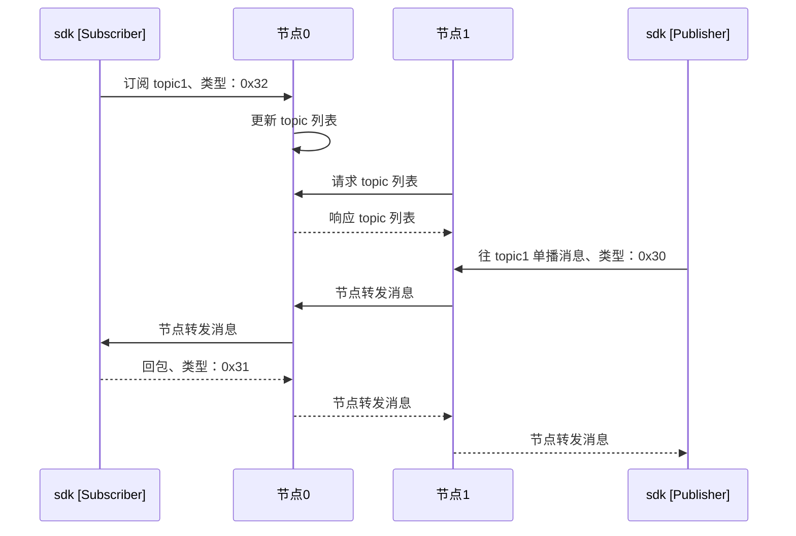
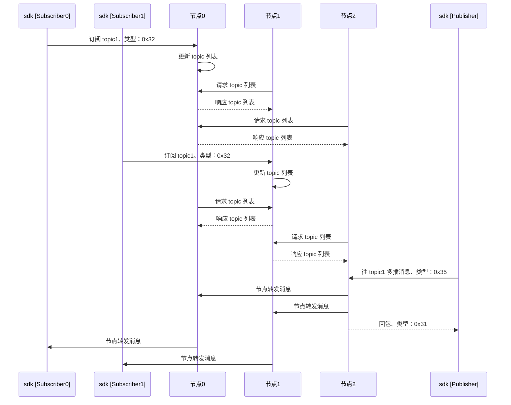
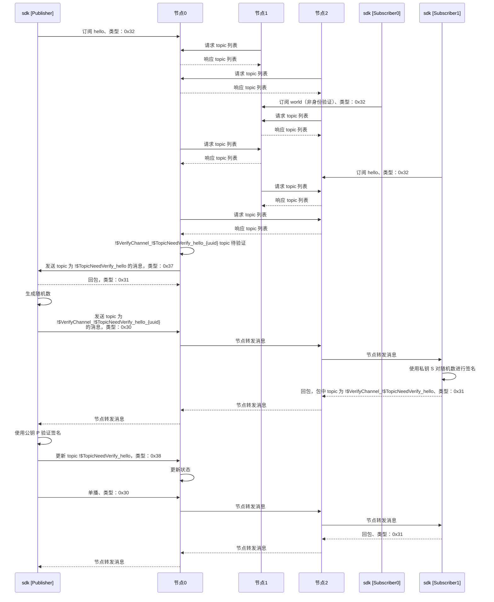

[toc]

# 时序图

## 单播时序图

> 注解：
>
> - 单播是指如果有多个 Subscriber 订阅同一个 topic，节点则随机选择一个 Subscriber 推送消息
> - 订阅和单播需要选择同一个 topic
> - Subscriber 接受到消息之后的回包是由 sdk 自动发送，不需要用户自己处理，该回包仅仅表示 Subscriber 成功收到消息
> - 如果在 Publisher 推送消息之前，没有对应的订阅者，那么 Publisher 将会收到错误码 *100*，表示没有可用节点

## 多播时序图

> 注解：
>
> - 多播是指如果有多个 Subscriber 订阅同一个 topic，节点则向所有的 Subscriber 推送消息
> - 节点 0 顺序转发消息后，会直接给 Publisher 返回消息转发成功

## 带身份验证的单播时序图

> 注解：
>
> - 身份验证直观的解释是： Publisher 在推送消息的时候，只给满足身份条件的订阅者推送消息
> - Publisher 拥有公钥 P，同时监听*#!$TopicNeedVerify_hello*  和 *#!​\$PushChannel_#!​\$TopicNeedVerify_hello* 两个 topic
> - Subscriber1 拥有私钥 S，同时监听 *#!$TopicNeedVerify_hello* 和*#!\$VerifyChannel_#!\$TopicNeedVerify_hello_{uuid}* 两个 topic
> - 时序图中所有的 *!$* 前都缺少符号 *#*， mermaid 不支持该符号转义
> - 节点0 给 Publisher 发送 0x37 消息时，除了 topic：*#!$TopicNeedVerify_hello*，还有 topicForCert：*#!\$VerifyChannel_#!\$TopicNeedVerify_hello_{uuid}* 以及 *NodeID*
> - 身份验证通过之后，推送消息使用的 topic 为 *!$TopicNeedVerify_hello*
> - 带身份验证的多播在验证身份的流程上同带身份验证的单播一致。不同点在于单播推送消息是一对一，而多播推送消息是一对多
>